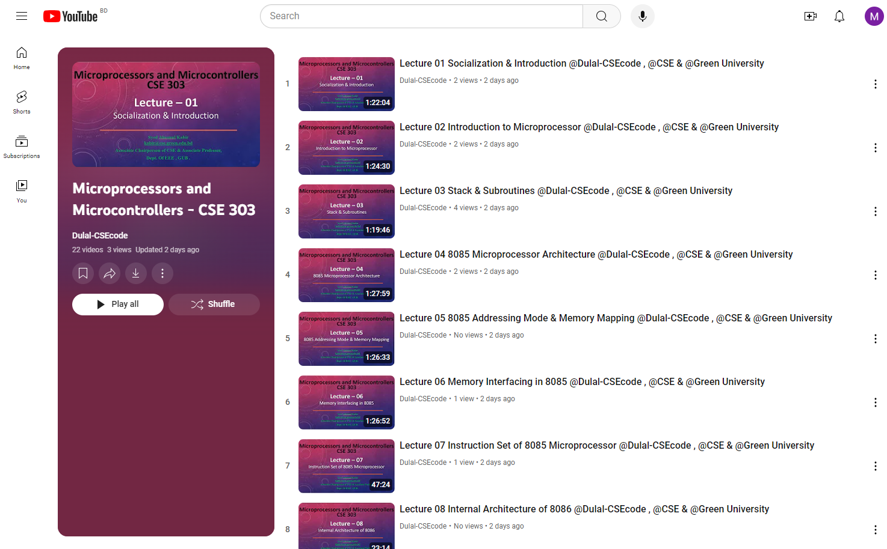

<h1 align="center">--- Microprocessors-and-Microcontrollers-CSE-303 ---</h1>  
<h3 align="center">-- Fall 2022 --</h3>  
<br />  
Welcome to the Microprocessors and Microcontrollers CSE-303 repository. This repository contains course materials, assignments, and resources for the Microprocessors and Microcontrollers course.  
<br />  
Check out the playlist now and start your learning journey: [Microprocessors and Microcontrollers CSE-303 Youtube Playlist Link : ](https://youtube.com/playlist?list=PLEc-WcPXUsjsFoZ2CKQC9CTL5pTjo4vb_&si=jbU38IgoQfKbb8cE)
**Happy Learning!**
<br />



  
<br />  

## Table of Contents
- [Introduction](#introduction)
- [Course Outline](#course-outline)
- [Installation](#installation)
- [Prerequisites](#prerequisites)
- [Assignments and Practice Problems](#assignments-and-practice-problems)
- [Usage](#usage)
- [Contributing](#contributing)
- [License](#license)

## Introduction

In this course, we will explore the architecture, programming, and interfacing of microprocessors and microcontrollers. The repository provides a comprehensive guide to understanding and applying these principles through problem-solving and hands-on projects.

## Course Outline

### 1-2. Microcontroller & Microcomputer, Evaluation of Microprocessor & Application
- **Text:** 1.2, 1.5, 1.6, 1.8, 1.10, 1.12
  - Problem-solving in class.
  - **Outcome:** CO1

### 2-3. Introduction to 8-bit, 16-bit, and 32-bit Microprocessors
- **Text:** 2.1, 2.3, 2.7
  - Problem-solving in class.
  - **Outcome:** CO1

### 4-5. Addressing Modes: Absolute Addressing
- **Text:** 2.15
  - Problem-solving in class.
  - **Outcome:** CO1

### 6-7. 8086 Internal Architecture, PIN Diagram of 8086
- **Text:** 2.7, 2.10
  - Problem-solving in class.
  - **Outcome:** CO1

### 8-9. Max-Min Mode, Register Structure
- **Text:** 2.3 (R2)
  - Problem-solving in class.
  - **Outcome:** CO2

### 10-12. Memory Read/Write Cycle, Instruction Set
- **Text:** 2.4, 2.5
  - Problem-solving in class.
  - **Outcome:** CO2

### 13-14. Pipeline Concept: Interrupts
- **Text:** 2.11, 2.12
  - Problem-solving in class.
  - **Outcome:** CO2

### 15-16. Programmed I/O, Memory Mapped I/O, Interrupt Driven I/O, Direct Memory Access
- **Text:** 9.2, 9.3, 9.8, 9.46
  - Problem-solving in class.
  - **Outcome:** CO3

### 17-18. Block Transfer; Cycle Stealing
- **Text:** 10.7 (R1)
  - Problem-solving in class.
  - **Outcome:** CO3

### 19-20. Interleaved; Multi-Tasking and Virtual Memory
- **Text:** 15.2
  - Problem-solving in class.
  - **Outcome:** CO3

### 21-22. Memory Interface; Bus Interface; Arithmetic Co-Processor
- **Text:** 6.4 (R2), 10.3 (R1)
  - Problem-solving in class.
  - **Outcome:** CO3

### 23-24. Assembly Language Programming of 8086 Microprocessors
- **Text:** 3.9, 3.11, 3.17
  - Problem-solving in class.
  - **Outcome:** CO3

## Installation

To set up the environment:

1. Clone the repository:
   ```bash
   git clone https://github.com/Dulal-CSEcode/Microprocessors-and-Microcontrollers-CSE-303.git
   cd Microprocessors-and-Microcontrollers-CSE-303
2. Install any required packages or dependencies. For example, on a Debian-based system:

    ```bash
    sudo apt-get update
    sudo apt-get install build-essential
    ```

## Prerequisites

Before you begin, ensure you have met the following requirements:

- You have a basic understanding of accounting principles.
- You have access to a text editor.
- You have installed Git on your computer.

## Assignments and Practice Problems

This repository includes a collection of assignments and practice problems to help reinforce the concepts taught in the course. Each assignment is located in its respective directory with detailed instructions and resources.

## Usage

Navigate to the specific topic or assignment directory and follow the instructions provided in the README.md file located in each folder.

## Contributing
Contributions are welcome! To contribute, please follow these steps:

1. Fork the repository.

2. Create a new branch (e.g., feature-branch).

3. Make your changes and commit them (git commit -m 'Add new feature').

4. Push to the branch (git push origin feature-branch).

5. Create a pull request.

Please ensure your code follows the repository's coding standards and includes appropriate tests.

## License
This project is licensed under the MIT License. See the LICENSE file for more details.

<br/>
<h2 align="center"> Thanks for visiting the Microprocessors-and-Microcontrollers-CSE-303 repository.</h2>
<h3 align="center">© All rights reserved by Dulal-CSEcode @2024 © Department of Computer Science and Engineering, GUB </h3>
